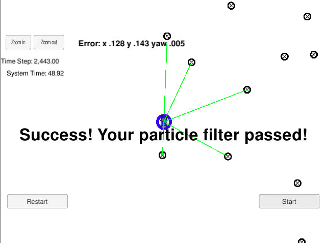

# **Kidnapped Vehicle Project** 

## Writeup

---

**Build a Particle Filter Project**

The goals / steps of this project are the following:
* Implement Particle Filter in C++
* Make sure particle filter localizes the vehicle to within the desired accuracy
* Make sure particle runs within the specified time of 100 seconds

## Rubric Points
### Here I will consider the [rubric points](https://review.udacity.com/#!/rubrics/747/view) individually and describe how I addressed each point in my implementation.  

---
### Writeup / README

#### 1. Implement Particle Filter in C++

Here is a link to my [project code](./src)

#### 2. Make sure particle filter localizes the vehicle to within the desired accuracy

I could see the words "Success! Your particle filter passed!". It means I made sure particle filter localizes the vehicle to within the desired accuracy.

#### 3. Make sure particle runs within the specified time of 100 seconds

As I said, I could see the words "Success! Your particle filter passed!". It means I made sure particle runs within the specified time of 100 seconds.

Movies which my particles work are following. 5 particles did not localizes the vehicle to within the desired accuracy.

[Particles = 5](https://youtu.be/D436mJEW4Ig)

[Particles = 20](https://youtu.be/sF5CfZme9Lo)

[Particles = 100](https://youtu.be/B0k-wlATbls)

[Particles = 200](https://youtu.be/qKSKL3-qT40)